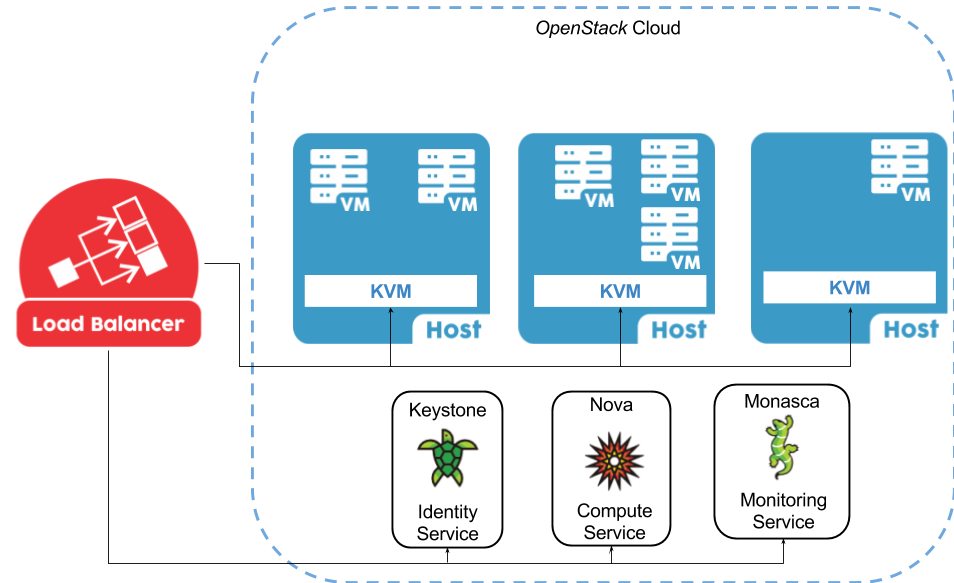

BigSea WP3 - LoadBalancer
=========================

#### Table of Contents

- [Overview](#overview)
    - [Architecture](#architecture)
- [Heuristics](#heuristics)
    - [Creating a Heuristic](#creating-a-heuristic)
- [Installation](#installation)
- [Configuration](#configuration)
    - [Example of configuration file](#example-of-configuration-file)
- [Running the LoadBalancer](#running-the-loadbalancer)


Overview
--------

The Load Balancer service is responsible for managing a specific subset of hosts, where VM's are running applications,
and reallocate VM's that are on overloaded hosts, the decision is based on the heuristic that is in the configuration file.


### Architecture

The LoadBalancer need to access to Keystone, Nova and Monasca in your OpenStack Cloud Infrastructure,
sometimes it may require ssh access to hosts to perform actions (e.g. discover VM's CPU capacity)




### Dependencies

To have your Load Balancer working properly you need to ensure that it has access to following components in your Infrastructure:

* OpenStack Identity Service - *Keystone*
* OpenStack Compute Service - *Nova* (with admin privileges)
* OpenStack Monitoring Service - *Monasca*
* Infrastructure Hosts (KVM Hypervisor)


Heuristics
----------

The heuristics are responsible to periodically verify which hosts are overloaded, taking actions to reallocate VM's of these hosts
to others, trying to make them less overloaded than before when possible.
You can write your own heuristics, just follow the steps in [Creating a Heuristic](#creating-a-heuristic)
Below we list all parameters that help in the heuristics decisions and all available heuristics in our repository.


#### Parameters

- `cpu_ratio`: (Float) The ratio of number of cpus cores to take in consideration if the hosts are overloaded.
- `wait_rounds`: (Integer) The number of executions of the heuristic that each instance has to wait before be migrated again.


#### List of Available Heuristics

- [BalanceInstancesOS](loadbalancer/service/heuristic/doc/balance.md)
- [CPUCapAware](loadbalancer/service/heuristic/doc/cpu_capacity.md)
- [SysbenchPerfCPUCap](loadbalancer/service/heuristic/doc/performance.md)


#### Creating a Heuristic

1. Create a python module file in `loadbalancer/service/heuristic` directory
2. In the module file create a class that inherits `BaseHeuristic` class from `loadbalancer/service/heuristic/base.py`
3. You must override `collect_information` and `decision` methods in your class.

**Note:** Remember to update the `heuristic` section in your configuration file with the heuristic you want to use.


Installation
------------

To install the Load Balancer you will need a virtual machine with a fresh install environment and with the configuration described below.

**Minimal Server Configuration**
```
OS: Ubuntu 14.04
CPU: 1 core
Memory: 2G of RAM
Disk: there is no disk requirements
```

### Steps

1. Update and Upgrade your machine
    ```bash
    $ sudo apt-get update && sudo apt-get upgrade
    ```
2. Install pip and dependencies
    ```bash
    $ sudo apt-get install python-setuptools python-dev build-essential
    $ sudo easy_install pip
    ```
3. Install git
    ```bash
    $ sudo apt-get install git
    ```
4. Install ssl
    ```bash
    $ sudo apt-get install libssl-dev
    ```
5. Clone the BigSea Load Balancer repository
    ```bash
    $ git clone https://github.com/bigsea-ufcg/bigsea-loadbalancer.git
    ```
6. Access the bigsea-loadbalancer folder to install the requirements
    ```bash
    # Some requirements need sudo.
    $ ./install.sh
    ```


Configuration
-------------

A configuration file is required to run the loadbalancer. You can find a template in the main directory called
`loadbalancer.cfg.template`, rename the template to `loadbalancer.cfg` or any other name you want.
Make sure you have fill up all fields before run.


### Example of configuration file

`loadbalancer.cfg.template`


```
[monitoring]
username=<@username>
password=<@password>
project_name=<@project_name>
auth_url=<@auth_url>
monasca_api_version=v2_0

[heuristic]
# The filename for the module that is located in /loadbalancer/service/heuristic/
# without .py extension
module=<module_name>
# The class name that is inside the given module, this class should implement BasicHeuristic
class=<class_name>
#Number of seconds before execute the heuristic again
period=<value>

[infrastructure]
# The user that have access to each host
user=<username>
#List of full hostnames of servers that the loadbalancer will manage (separated by comma).
#e.g compute1.mylab.edu.br
hosts=<host>,<host2>
#The key used to access the hosts
key=<key_path>
#The type of IaaS provider on your infrastructure e.g OpenStack, OpenNebula
provider=<provider_name>

[openstack]
username=<@username>
password=<@password>
user_domain_name=<@user_domain_name>
project_name=<@project_name>
project_domain_name=<@project_domain_name>
auth_url=<@auth_url>

[optimizer]
# The filename for the module that is located in /loadbalancer/service/heuristic/
# without .py extension
module=<optimizer_module_name>
# The class name that is inside the given module, this class should implement BaseOptimizer
class=<optimizer_class_name>
# The url to make the request to the optimizer service
request_url=<http://url/...>
# The type of the request: GET, POST, etc...
request_type=<type>
# Parameters to be used with the request url
request_params=<params>
```

Limitations
-----------

* Only support OpenStack Infrastructure
* Nova Live Migrations considers only *shared storage-based live migrations* [1](https://docs.openstack.org/nova/pike/admin/configuring-migrations.html)


Running the LoadBalancer
------------------------

    $ cd bigsea-loadbalancer/
    $ export PYTHONPATH=":"`pwd`

#### Default configuration file

    $ python loadbalancer/cli/main.py

#### Especific configuration file

    $ python loadbalancer/cli/main.py -conf load_balancer.cfg
