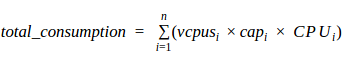
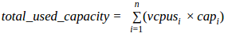

ProactiveCPUCap Heuristic
=========================

#### Table of Contents
- [Description](#description)
    - [Parameters](#parameters)
    - [Scenarios](#scenarios)
- [Algorithm](#algorithm)
- [Configuration](#configuration)
    - [Example of heuristic section in configuration file](#example-of-heuristic-section-in-configuration-file)
- [Dependencies](#dependencies)


Description
-----------

This heuristic aims to balance the hosts that are overloaded, by migrating the instances that are responsible for the increased utilization in the hosts.
A host is considered overloaded when the host total consumption or total used capacity is greater than the provided `cpu_ratio`.
The total consumption and total used capacity for each host are given by the following formulas:


Sum of the consumption of each VM on the host




Sum of the used capacity of each VM on the host




Below we list the parameters that the ProactiveCPUCap use and some scenarios results

### Parameters

- `cpu_ratio`: (Float) The ratio of number of cpus cores to take in consideration if the hosts are overloaded.
- `wait_rounds`: (Integer) Number of executions of the heuristic that each instance has to wait before be migrated again.


### Scenarios

<Add scenarios>


Algorithm
---------

```
1. Select all hosts that are overloaded
2. If no overloaded hosts or If all overloaded hosts are equal to the all hosts given in the infrastructure section, nothing can be done
3. For each overloaded host
    3.1 While selected_host is overloaded and still have instances to try to migrate:
        3.1.1 Selected instance with high utilization that wasn't migrated before.
        3.1.2 Look for a host that is less loaded and can recive this instance without exceed the cpu_ratio.
4. Migrate the all instances selected
5. Update the number of wait rounds for all migrated instances.
```


Configuration
-------------

To configure this heuristic you need to add two parameters in the `heuristic` section in the configuration file, thoose parameters are:
`cpu_ratio`and `wait_rounds`.

You can find an example of configuration file for this heuristic [here](../../../../examples/load_balancer_proactivecap.cfg).

### Example of heuristic section in configuration file

`load_balancer_proactivecap.cfg`


```
[heuristic]
# The filename for the module that is located in /loadbalancer/service/heuristic/
# without .py extension
module=cpu_capacity
# The class name that is inside the given module, this class should implement BasicHeuristic
class=ProactiveCPUCap
#Number of seconds before execute the heuristic again
period=600
# A float value that represents the ratio o number of cores in the hosts.
cpu_ratio=1
# An integer that represent the number of rounds that a instance need to wait before be migrated again
# Each round represents an execution of the loadbalancer
wait_rounds=1
```

Dependencies
------------

- *Monasca*
In your Monasca you should ensure that you have the following metrics:
- `cpu.percent`: Informs the percentage of cpu used by a host.
- `vm.cpu.utilization_norm_perc`: Informs the normalized cpu utilization percentage for instances in the hosts

- *Hypervisor KVM*
Your hosts should provide use KVM as hypervisor to allow the collection of the capacity of the instances through the `virsh` command through ssh connection.
