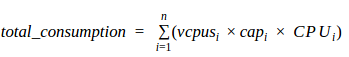
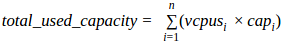

SysbenchPerfCPUCap Heuristic
============================

#### Table of Contents
- [Description](#description)
- [Algorithm](#algorithm)
- [Configuration](#configuration)
    - [Example of heuristic section in configuration file](#example-of-heuristic-section-in-configuration-file)
- [Dependencies](#dependencies)


Description
-----------

This heuristic aims to balance the hosts that are overloaded, a host is considered overloaded when the host total
consumption or total used capacity is greater than the provided `cpu_ratio`. The decision for which instance should
be migrated is based on the performance of the available hosts, if any hosts have better performance the selected
instances are the ones that has higher utilization, otherwise the instances will be the ones that has lower utilization.
The total consumption and total used capacity for each host are given by the following formulas:


Sum of the consumption of each VM on the host




Sum of the used capacity of each VM on the host




Algorithm
---------

```
1. Select all hosts that are overloaded
2. If no overloaded hosts or If all overloaded hosts are equal to the all hosts given
in the infrastructure section, nothing can be done
3. For each overloaded host
    3.1. While selected_host is overloaded:
        3.1.1. While hosts with better performance it isn't empty:
            3.1.1.1. Search for the instance with higher utilization that wasn't migrated before
            3.1.1.2. If selected_host is not overloaded: break
        3.1.2. If selected_host is not overloaded: break
        3.1.3. While hosts with better performance it isn't empty:
            3.1.3.1. Search for the instance with lower utilization that wasn't migrated before
            3.1.3.2. If selected_host is not overloaded: break
        3.1.4. If selected_host is still overloaded: break, all possibilities are over
4. Migrate the all instances selected
5. Update the number of wait rounds for all migrated instances.
```


Configuration
-------------

To configure this heuristic you need to set two parameters in the `heuristic` section in the configuration file, thoose parameters are:
`module`and `class`.

You can find an example of configuration file for this heuristic [here](../../../../examples/load_balancer_sysbenchperfcpucap.cfg).

### Example of heuristic section in configuration file

`load_balancer_sysbenchperfcpucap.cfg`


```
[heuristic]
# The filename for the module that is located in /loadbalancer/service/heuristic/
# without .py extension
module=benchmark_performance
# The class name that is inside the given module, this class should implement BasicHeuristic
class=SysbenchPerfCPUCap
```

Dependencies
------------

- *Monasca*
In your Monasca you should ensure that you have the following metrics:
- `cpu.percent`: Informs the percentage of cpu used by a host.
- `vm.cpu.utilization_norm_perc`: Informs the normalized cpu utilization percentage for instances in the hosts
- `sysbench.cpu.performance`: Inform the time that the host take to execute the sysbench, used to compare the performance  of hosts. (lower is better)

- *Hypervisor KVM*
Your hosts should provide use KVM as hypervisor to allow the collection of the capacity of the instances through the `virsh` command through ssh connection.
